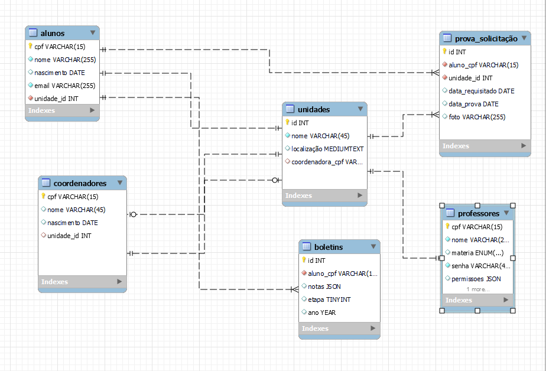

# O Projeto
A ideia do projeto é ensinar por meio prático o funcionamento de um sistema administrativo de uma escola, como funciona o back-end, o front-end e além de tudo isso
como funciona o o banco de dados criado para o projeto

## Tecnologias
As tecnologias empregadas são:
- Python3(Flask e mysqlconnector...)
- MySQL
- ReactJS

## Funcionamento do banco
O banco de dados foi construido apartir da ideia de que a escola contenha 2 tipos de funcionários dividos em tabelas, sendo eles os:
- Coordenadores
- Professores

Além disso foi divido em tabela os boletins, as unidades da escola(supondo que seja uma rede de escolas) e solicitação de segunda chamada das provas.  
*Obs: As senhas não estão sendo salvas como `hashs` para facilitar o entendimento para iniciantes!!!*

## Como rodar o projeto?

### Requisitos e preparo

Os requisitos para utilizar o [setup.py](/Back-End/api/setup.py) é a versão *3.12* do `Python` e as bibliotecas estão em  **`/back-end/config/requirements.txt`**, agora para criar o banco e rodar na máquina é *necessário a versão 8.0 ou superior do `MySQL`*, e o [arquivo de dump](/back-end/config/banco/script.sql) está em **`/back-end/config/banco/script.sql`**, uma imagem docker do sistema ainda não foi feita pois ainda está em desenvolvimento.

## Rotas da API já feitas
### /alunos
- `/alunos/add`
- `/alunos/modificar`
- `/alunos/delete`
- `/alunos/consulta`
### /coordenadores
- `/coordenadores/add`
- `/coordenadores/delete`
- `/coordenadores/consulta`
### /unidades
- `/unidades/add`
- `/unidade/consulta`
- `/unidades/delete`